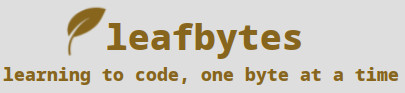

## leafbytes, a personal blog

[leafbytes](https://leafbytes.com)

This repository contains the various html, css, and javascript necessary for my personal blog, leafbytes. It is a simple static html site, currently hosted on Github Pages.

__Checklist:__

> - [x] Add favicon
> - [x] Add basic logo
> - [x] Add Code Snippets
> - [x] Create Navigation Bar
> - [ ] Create mock fill for blog posts/about/faq/links/contact
> - [ ] Add test images (jpgs, gifs)
> - [ ] Streamline Blog Post Methodology
> - [ ] Create Responsive Design for Tablet/Phone Use (started with desktop media query)
> - [ ] Program Dark/Light Mode
> - [ ] Article Idea: Why !bangs make ddg the best search engine for programmers
> - [ ] Article Idea: In pursuit of a purely textual browsing experience
> - [ ] Article Idea: Why every developer must eventually learn at least a few Vim Keybindings
> - [ ] Article Idea: Gushing over my desktop environment (bspwm and Artix)
> - [ ] Article Idea: Neovim, Zsh, and Git (setting up a minimalist development environment)
> - [ ] Article Idea: bgit, my simple bash script alternative to github-cli
> - [ ] Article Idea: Want to start knowing more about computers? Learn the command line first!
